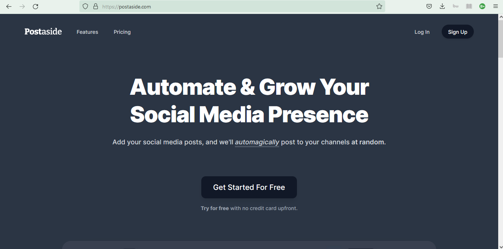

# PostAside clone
This is a clone of [Postaside](https://www.postaside.com) built with html, css, sass, & javascript

## Table of contents

- [Overview](#overview)
  - [Screenshot](#screenshot)
  - [Links](#links)
- [My process](#my-process)
  - [Built with](#built-with)
  - [What I learned](#what-i-learned)
  - [Useful resources](#useful-resources)
- [Author](#author)

## Overview

### Screenshot

### Links

- Live Site URL: [Github](https://jubril-a.github.io/PostAside-clone/)
- View Code: [Github](https://github.com/jubril-a/PostAside-clone)

## My process

### Built with

- Semantic HTML5 markup
- CSS custom properties
- Flexbox
- CSS Grid
- Mobile-first workflow
- Javascript (Ajax)
- [Sass](https://sass-lang.com/) - CSS Preprocessor

### What I learned

- Sass
- Responsive Web Design
- Git & Github

### Useful resources

- [Kevin Powell Youtube Channel](https://www.youtube.com/kepowob)
- [Sass tutorial for beginners by freecodecamp](https://www.youtube.com/watch?v=_a5j7KoflTs&t=2044s)
- [MDN Web Docs](https://developer.mozilla.org/en-US/docs/Learn)

## Author

- LinkedIn - [@Abdulsalam Jubril](https://www.linkedin.com/in/abdulsalam-jubril-83536121a)
- Dev.to - [@automate](https://dev.to/automate)
